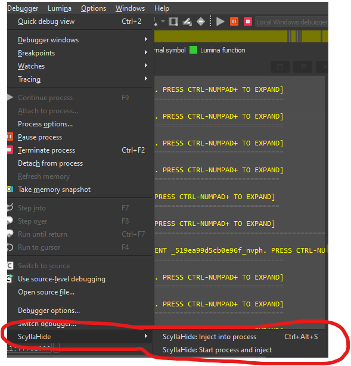

# IDAHide: ScyllaHide Auto-Injector for IDA Pro

A simple IDA Pro plugin to automate injecting ScyllaHide into a debugged process. It avoids the manual steps of finding the process ID and running the injector.

## Features

*   **One-Click Injection:** Inject ScyllaHide into the currently suspended process with a single menu/toolbar click or hotkey (`Ctrl-Alt-S`).
*   **Automatic Start & Inject:** Automatically start the target executable, wait for it to suspend at the entry point, and then inject ScyllaHide, all with one action (`Ctrl-Alt-R`).

## Installation

1.  Copy the `idahide` folder into your IDA Pro `plugins` directory (e.g., `C:\Program Files\IDA Pro 9.1\plugins\idahide`).
2.  This plugin is built for **IDA Pro 9.1**. It may or may not work with other versions.

## Configuration

This plugin relies on the ScyllaHide command-line injector. Before using the plugin, ensure the following files are placed inside the `idahide` plugin directory (alongside `idahide_plugin.py`):

*   `InjectorCLIx86.exe`
*   `InjectorCLIx64.exe`
*   `HookLibraryx86.dll`
*   `HookLibraryx64.dll`

These files are part of the official ScyllaHide distribution.

## How to Use

Once the plugin is installed and configured, you will find a new menu under **Debugger > ScyllaHide** and a new **ScyllaHide toolbar**.

### Option 1: Inject into a Running Process

This is useful when you have already started debugging and have the process suspended.

1.  Start debugging your target application in IDA and let it suspend (e.g., at the entry point or a breakpoint).
2.  Go to **Debugger > ScyllaHide > Inject into process** or press `Ctrl-Alt-S`.
3.  A new console window will appear for the injector, and ScyllaHide will be injected.
4.  You can now resume the process in IDA (`F9`).

### Option 2: Start Process and Inject

This is the most convenient method for starting a new debugging session.

1.  Make sure your target executable is configured in **Debugger > Process options**.
2.  Go to **Debugger > ScyllaHide > Start process and inject**.
3.  The plugin will automatically start the process, wait for it to suspend, and then inject ScyllaHide. You can also use the `Ctrl-Alt-R` hotkey.
4.  You can now resume the process in IDA (`F9`).

## How It Works

*   **Injection:** This is a very simple plugin. It gets the Process ID (PID) of the debugged process and uses Python's `subprocess.Popen` to launch the appropriate ScyllaHide `InjectorCLI` executable (`x86` or `x64`).
*   **Auto-Start:** For the "Start process and inject" action, the plugin uses a temporary `DBG_Hooks` instance. It hooks the `dbg_suspend_process` event, which fires when IDA starts and suspends the new process. The hook then calls the injection logic and unhooks itself.